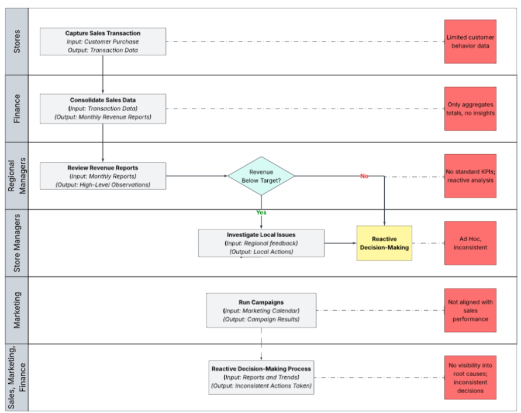
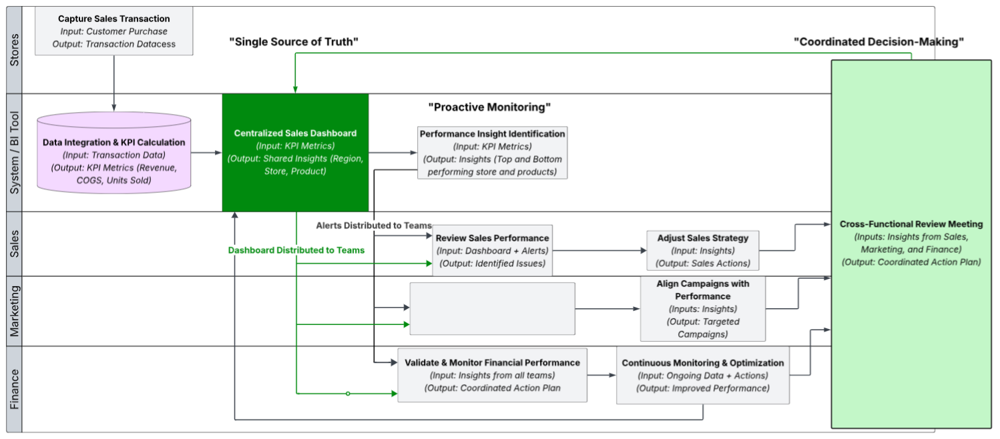
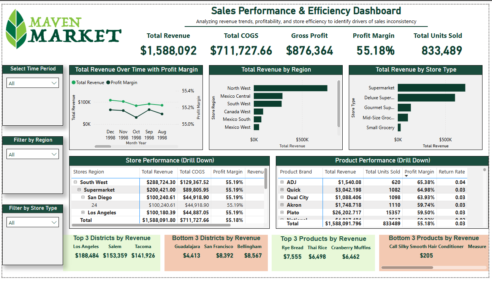

# Retail Sales Performance Optimization
*End-to-end Business Analysis project focused on identifying drivers of inconsistent sales performance and enabling proactive, data-driven decision-making through process redesign and dashboard development.*

## Business Problem
The business experienced inconsistent sales performance over a 6–8 month period, with limited visibility into the underlying drivers of these fluctuations.

This resulted in:

- Reactive decision-making
- Lack of alignment across departments
- No standardized KPI tracking
  
## Objective
- Identify key drivers of sales variability across regions, stores, and products
- Enable proactive decision-making through real-time insights
- Establish a single source of truth for performance metrics
- Improve cross-functional alignment between Sales, Marketing, and Finance

## My Role
### Business Analyst
- Conducted process analysis (AS-IS → TO-BE)
- Identified business gaps and inefficiencies
- Defined functional requirements and KPIs
- Designed a centralized reporting solution
- Translated business needs into dashboard features

### Full Documentation
**Business Requirements Document (BRD)**

  
## Current State (AS-IS)
The existing process was fragmented and reactive:
- Data aggregated at a high level with no actionable insights
- No standardized KPIs across teams
- Decisions made independently across departments
- Limited visibility into root causes of performance issues
  
Result: Delayed and inconsistent decision-making

## Key Gaps Identified
- No centralized view of performance data
- Lack of real-time insights
- Siloed decision-making across teams
- No consistent KPI tracking

## Future State (TO-BE Solution)
Designed a centralized, data-driven performance system:
- Unified dashboard with real-time KPI tracking
- Automated identification of top/bottom performers
- Cross-functional access to shared insights
- Continuous performance monitoring

## Business Impact
**Key Improvements:**
- Centralized visibility across all business units
- Faster identification of performance issues
- Improved alignment between Sales, Marketing, and Finance
- Standardized KPI tracking across teams
  
**Success Metrics:**
- Increased dashboard adoption (target: 90%)
- Reduced time to identify performance issues
- Improved decision speed 

## Solution Overview (Dashboard)
Developed a Power BI dashboard to:

- Track KPIs (Revenue, COGS, Units Sold)
- Analyze regional and store performance
- Identify top and bottom performing products
- Enable drill-down analysis for deeper insights

## Dashboard Preview

## Tools Used
- Power BI
- Excel
- Data Modeling
- KPI Design
- Process Mapping (Lucidchart)
  

##  Author
**Samantha Bradley-Holt**

**Business Analyst Project**

